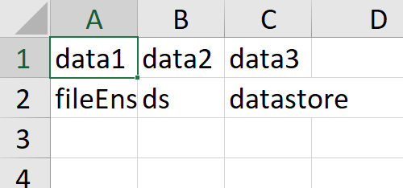
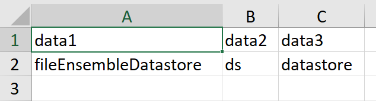

# Excel ファイルのセル幅自動調整
Copyright (c) 2020, The MathWorks, Inc.

# やったこと


Excel ファイルに書き出した時にセル幅が残念な場合があります。これを自動調節してみました。ただ、残念ながら MATLAB 側の機能ではできそうにないので、MATLAB から Excel の機能を使います。


公式ページとしてはこちら：[Excel をオートメーション サーバーとして使用したスプレッドシート データの読み取り](https://jp.mathworks.com/help/matlab/matlab_external/example-reading-excel-spreadsheet-data.html)


## 環境


MATLAB R2020a


  
## 具体的には


例えば table 型で


```matlab:Code
data = ["fileEnsembleDatastore","ds","datastore"];
data = array2table(data)
```

| |data1|data2|data3|
|:--:|:--:|:--:|:--:|
|1|"fileEnsembleDatasto...|"ds"|"datastore"|


というデータを Excel に書き出してみます。


```matlab:Code
filename = 'undisiredFormat.xlsx';
writetable(data,filename);
```





Excel で開くと多少残念な気持ちになります。


これを


```matlab:Code
autoFitCellWidth(filename);
```





とデータの長さに合わせてセル幅を調整させるというお話。


# 余談：Excel に書き出すための関数


MATLAB から Excel ファイルに出力する関数としては [xlswrite 関数](https://jp.mathworks.com/help/matlab/ref/xlswrite.html)が長らく使われていましたが、最近は


   -  [writetable 関数](https://jp.mathworks.com/help/matlab/ref/writetable.html)（R2013b～）: table 型変数の出力 
   -  [writetimetable 関数](https://jp.mathworks.com/help/matlab/ref/writetimetable.html)（R2019a～）：timetable 型変数の出力 
   -  [writematrix 関数](https://jp.mathworks.com/help/matlab/ref/writematrix.html)（R2019a～）：array (double型/string型) の出力 
   -  [writecell 関数](https://jp.mathworks.com/help/matlab/ref/writecell.html) (R2019a～）：cell 配列の出力 


などが推奨されています。同様に [csvwrite 関数](https://jp.mathworks.com/help/matlab/ref/csvwrite.html)も「非推奨」の文字が出るようになりました。


## なんで xlswrite が非推奨？


書き出し速度が段違いです。


```matlab:Code
data = rand(10,10);
tic
xlswrite('test_xlswrite.xlsx',data);
toc
```


```text:Output
経過時間は 0.412357 秒です。
```


```matlab:Code
tic
writematrix(data,'test_writematrix.xlsx');
toc
```


```text:Output
経過時間は 0.132222 秒です。
```


かなり違います。


xlswrite 関数は Excel を起動しているので時間がかかります。


何度も呼び出すとそのたびに Excel 起動して閉じてを繰り返すので大変時間がかかります。write* 系を使いましょう。


# セル幅調整


さて本題。関数の中身を見た方が速いですね。VBA に詳しい方ならピンとくると思いますが、、どうでしょう。


```matlab:Code(Display)
function autoFitCellWidth(filename)

    % Excel ファイルへの絶対パスを取得
    filepath = which(filename);
    
    % Excel に対して ActiveX を開く
    h = actxserver('excel.application');
    wb = h.WorkBooks.Open(filepath);
    
    % UsedRange: データが入っている範囲の
    % EntireColumn: 列全体を
    % AutoFit: データに合わせた幅にします
    wb.ActiveSheet.UsedRange.EntireColumn.AutoFit;
    
    % 指定したファイル名で保存しエクセルを閉じる
    wb.SaveAs(filename);
    wb.Close;
    h.Quit;
    h.delete;
    % 注意：この辺キッチリ Close/Quit/delete しておかないとあとでややこしいです。
    %（ほかのアプリで使われていて開けない・消せないなど起こります）
    % PC 再起動すれば大丈夫です。
end
```


ActiveSheet やら UsedRange やら EntireColumn などは Excel 側のコマンド。同じ要領で他にも Excel ができることはできちゃう、、はず。


## その他の編集作業例


範囲を指定して同じ作業をするなら


```matlab:Code(Display)
    range = 'A1:H5';
    wbrange = wb.ActiveSheet.get('Range',range);
    wbrange.EntireColumn.AutoFit;
```


とか、セル幅を決め打ちで行くなら


```matlab:Code(Display)
    wbrange.EntireColumn.ColumnWidth = 20;
```


など。


あとセルの塗りつぶしや文字の色を変えるなら


```matlab:Code(Display)
    % セルの塗りつぶし
    wb.ActiveSheet.UsedRange.Interior.Color=hex2dec('00FF00'); % 緑
    % フォントの色
    wb.ActiveSheet.UsedRange.Font.Color=hex2dec('0000FF'); % 赤
    % 色は16進数の BGR の組み合わせで指定
    % 赤: 0000FF
    % 青: FF00FF
    % 緑: 00FF00
    % 黒: 000000
    % 白: FFFFFF
```


こんな感じです。他にも MATLAB Answers にもいくつか例がありますのでもし必要があればぜひ。


# 参考

   -  [Office VBA Reference/Excel/Object model/Range object](https://docs.microsoft.com/en-us/office/vba/api/excel.range(object)) 
   -  [TipsFound: VBA 列の幅を調整する](https://www.tipsfound.com/vba/09010) 
   -  [MATLAB Answers: ActiveX を使って Excelの任意のセルに画像を挿入することはできますか？](https://jp.mathworks.com/matlabcentral/answers/387921-activex-excel) 
   -  [MATLAB Answers: MATLAB から Excel Spreadsheet にセル背景色やフォント色を指定してデータを書くにはどうしたらよいですか？](https://jp.mathworks.com/matlabcentral/answers/95482-matlab-excel-spreadsheet) 
   -  [MATLAB Answers: XLSWRITE 関数で、指定したワークシートのみ持つ Excel ファイルを作成できますか？](https://jp.mathworks.com/matlabcentral/answers/99172-xlswrite-excel) 
   -  [MATLAB Answers: Excel ファイルのシート名を変更することはできますか？](https://jp.mathworks.com/matlabcentral/answers/102016-excel) 

