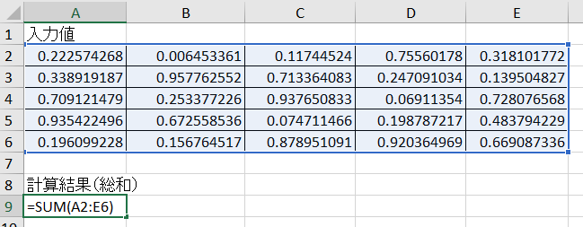

# 【MATLAB】Excel 内での計算結果を更新させる方法


Copyright (c) 2020, The MathWorks, Inc.


# はじめに


Excel シートに MATLAB から何らかの値を出力して、Excel を開くことなくその値に対して Excel 内で何らかの計算処理を同時にさせたい。そんな時には `'UseExcel'` オプションを使うといいよというお話。


  


Twitter で豆腐さんど ([@tohu_sand](https://twitter.com/tohu_sand)) との[やり取り](https://twitter.com/tohu_sand/status/1322513635051151362)をしたので備忘録としてまとめておきます。


`'UseExcel'` オプションは R2019b からはデフォルトで `'false'` ですが、それまでは Excel が使える環境であれば `'true'` であったという点には要注意。なので R2019a 以前を使っている場合は、特に意識する必要はないと思います。リリースノートへのは[こちら: UseExcel](https://jp.mathworks.com/help/matlab/release-notes.html?rntext=UseExcel&startrelease=R2017b&endrelease=R2020b&groupby=release&sortby=descending&searchHighlight=UseExcel)。


  
## 使用環境 

   -  MATLAB R2020b 

# やりたいこと


例えばこんな感じ。


```matlab:Code
data = rand(5,5);
writematrix(data,'example.xlsx','Range','A2:E6');
```





MATLAB から入力値を出力し、総和は Excel で計算する。（これくらいの計算であれば MATLAB でやってしまえ・・という話もありますがあくまで例です。）


Excel への出力の仕方によっては、改めて Excel ファイルを開かないと A9 の総和が更新されない。


  
# 値が更新されないとは？


A2:E6 の範囲にあたらしい値を MATLAB から出力しても A9 の値が変わらないままになる現象です


ただ書き出すだけであればいいんですが、Excel 内での処理結果を確認すると


```matlab:Code
data = rand(5,5);
writematrix(data,'example.xlsx','Range','A2:E6');
readmatrix('example.xlsx','Range','A9:A9')
```


```text:Output
ans = 12.6398
```


```matlab:Code
sum(data,'all')
```


```text:Output
ans = 12.0239
```


と値が異なるというか、A9 の値が更新されないという落とし穴があります。もちろん Excel ファイルを開けば結果は更新されるんですが、いちいち開くのも面倒くさい場合もあると思います。


  
# なんで更新されない？


最近は [xlsread 関数](https://jp.mathworks.com/help/matlab/ref/xlsread.html)や [xlswrite 関数](https://jp.mathworks.com/help/matlab/ref/xlswrite.html)は非推奨となっている（[なんで xlswrite が非推奨？](https://qiita.com/eigs/items/3a71c0da1744e48e9bca#%E3%81%AA%E3%82%93%E3%81%A7-xlswrite-%E3%81%8C%E9%9D%9E%E6%8E%A8%E5%A5%A8)）いて、代わりに writematrix 関数や writetable 関数の使用が薦められています。


ちなみに [xlswrite 関数](https://jp.mathworks.com/help/matlab/ref/xlswrite.html)を使うとちゃんと更新されます。


```matlab:Code
data = rand(5,5);
xlswrite('example.xlsx',data,'A2:E6');
readmatrix('example.xlsx','Range','A9:A9')
```


```text:Output
ans = 11.9684
```


```matlab:Code
sum(data,'all')
```


```text:Output
ans = 11.9684
```


大丈夫ですね。


これは [xlswrite 関数](https://jp.mathworks.com/help/matlab/ref/xlswrite.html)は（Excel がインストールされている環境であれば）実行時に Excel を起動するから。Excel が起動すると Excel 内の計算を実行することになります。xlswrite 関数が非推奨な大きな理由はこの Excel を起動する処理に時間がかかるためです。[writematrix 関数](https://jp.mathworks.com/help/matlab/ref/writematrix.html)などの比較的新しい関数は（R2019b 以降のデフォルトの設定では）Excel アプリを介することなくデータを出力します。


参考：ちなみに自動計算を停止させるよう設定も可能です。See. [Anyway to turn off Excel automatic calculation by a MatLab command for faster export ?](https://jp.mathworks.com/matlabcentral/answers/26847-anyway-to-turn-off-excel-automatic-calculation-by-a-matlab-command-for-faster-export)


  
# ではどうするか


Excel を起動してしまえばよいのかなと。他にも良い方法があればコメントください。


## 方法１


[writematrix 関数](https://jp.mathworks.com/help/matlab/ref/writematrix.html)には `'UseExcel'` というオプションがあり何も指定しなければ `'false'`、すなわち Excel を使用しません。ここを `'true'` に変更することで解決します。


```matlab:Code
data = rand(5,5);
writematrix(data,'example.xlsx','Range','A2:E6','UseExcel',true);
readmatrix('example.xlsx','Range','A9:A9')
```


```text:Output
ans = 13.7890
```


```matlab:Code
sum(data,'all')
```


```text:Output
ans = 13.7890
```


大丈夫ですね。総和（A9）もしっかり更新されています。


## 方法２


上で既にみた方法ですが [xlswrite 関数](https://jp.mathworks.com/help/matlab/ref/xlsread.html)も非推奨ではありますが必要があれば使ってもいいでしょう（個人的見解）。[xlswrite 関数](https://jp.mathworks.com/help/matlab/ref/xlsread.html)を使うことで Excel が起動され、計算結果も更新されます。


処理時間を比較してみます。


```matlab:Code
tic
writematrix(data,'example.xlsx','Range','A2:E6','UseExcel',true);
toc
```


```text:Output
経過時間は 0.390221 秒です。
```


```matlab:Code
tic
xlswrite('example.xlsx',data,'A2:E6');
toc
```


```text:Output
経過時間は 0.185799 秒です。
```


5x5 の行列であれば [xlswrite 関数](https://jp.mathworks.com/help/matlab/ref/xlsread.html)の方が速いみたいですね。


結果は載せていませんがデータ量が大きくなれば [writematrix 関数](https://jp.mathworks.com/help/matlab/ref/writematrix.html)の方が有利でした。同然の事ながら `'UseExcel' = false` (既定の設定) の方がもちろん速いです。


```matlab:Code
tic
writematrix(data,'example.xlsx','Range','A2:E6','UseExcel',false);
toc
```


```text:Output
経過時間は 0.017237 秒です。
```

## 方法3


もう十分かと思いますが、他の選択肢も一応ご紹介します。ActiveX 経由で Excel を一度起動させてしまう・・。


```matlab:Code
data = rand(5,5);
writematrix(data,'example.xlsx','Range','A2:E6');

tic
ExcelApp = actxserver('Excel.Application'); 
ExcelFile = ExcelApp.Workbooks.Open(fullfile(pwd,'\example.xlsx')); 
ExcelFile.Save; 
ExcelFile.Close; 
ExcelApp.Quit;
toc
```


```text:Output
経過時間は 2.573898 秒です。
```


```matlab:Code
readmatrix('example.xlsx','Range','A9:A9')
```


```text:Output
ans = 11.5360
```


```matlab:Code
sum(data,'all')
```


```text:Output
ans = 11.5360
```


欲しい結果になっていますが、これは時間がかかるので NG ですね。


# まとめ


データの出力には write* 系の関数がよさそうです。


MATLAB からファイルに出力する関数としては最近は


   -  [writetable 関数](https://jp.mathworks.com/help/matlab/ref/writetable.html)（R2013b～）: table 型変数の出力 
   -  [writetimetable 関数](https://jp.mathworks.com/help/matlab/ref/writetimetable.html)（R2019a～）：timetable 型変数の出力 
   -  [writematrix 関数](https://jp.mathworks.com/help/matlab/ref/writematrix.html)（R2019a～）：array (double型/string型) の出力 
   -  [writecell 関数](https://jp.mathworks.com/help/matlab/ref/writecell.html) (R2019a～）：cell 配列の出力 
   -  [writestruct 関数](https://jp.mathworks.com/help/matlab/ref/writestruct.html) (R2020b～）：構造体の出力 


などが推奨されています。同様に [csvwrite 関数](https://jp.mathworks.com/help/matlab/ref/csvwrite.html)も R2019a 以降「非推奨」の文字が出るようになりましたね。


